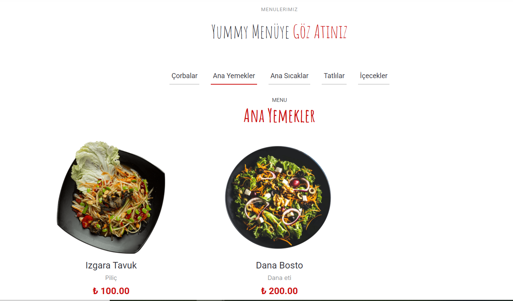

<html>
<head>
    <link rel="stylesheet" href="https://cdnjs.cloudflare.com/ajax/libs/font-awesome/5.15.4/css/all.min.css">
</head>
<body>

# Yummy Restoran Projesi 🚀

### Bu Proje .Net Framework MVC ve Code First Yaklaşımı Faydalanarak Geliştirmiştir

## Projede :

#### Kullanıllan teknolojiler  🛠:

   <ul style="list-style:circle; margin-left:30px"> 
		<li> HTML & CSS & JAVASCRIPT </li>
		<li> Bootstrap 5.3.3 </li>
		<li> Modal </li>
		<li> Font Awesome </li>
		<li> Entity Framework</li>
   </ul>

#### Veri tabanı 🗄️: 

<ul style="list-style:circle; margin-left:30px">
	<li>MSSQL</li>
</ul>

#### Kullanıllan Yapıları 	📚 :

<ul style="list-style:circle; margin-left:30px">
	<li> Entity Framework Code First Yaklaşımı </li>
	<li> Modal </li>
	<li> Login ve LogOut İşlemleri </li>

</ul>

## Admin Tarafı 🔧
 

### Login Paneli

### DashBoard Paneli

### Feature Paneli

### Hakkımızda Paneli

### Admin Paneli

### Kategori Paneli

### Ürün Paneli

### İletişim Paneli

### Rezervasyon Paneli

### Chef Paneli

### Etkinlikler Paneli

### Galleri Paneli

### Hizmet Paneli

### Mesaj Paneli

### Referanslar Paneli

### Sosyal Medya Paneli

## Yummy Web Sitesi  

### Ana Sayfa 

### Hakkımızda 

### Hizmetlerimiz

### İStatistikler 

### Menüler 

 #### Referanlarımız 

#### Etkinliklerimiz 

#### Cheflerimiz 

#### Rezervasyon Formu 

#### Gallerimiz 

#### İletişim 

### Diagram 

 Tabloları arasında ilişki gösterilmektedir.
</body>
<html>